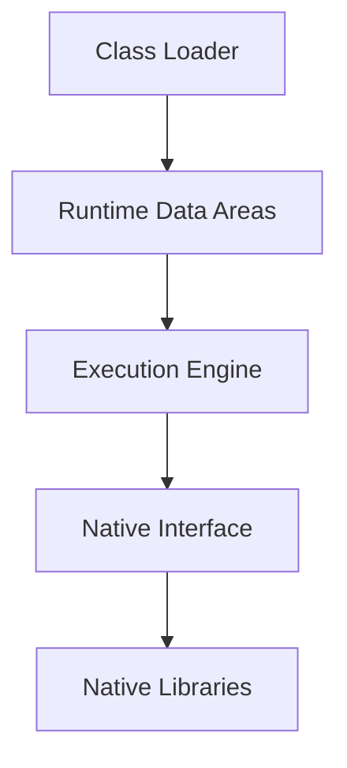
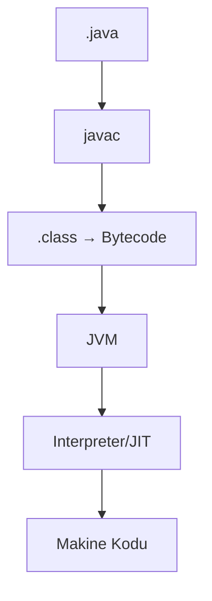

#Yazılım #ProgramlamaDilleri #Java 

![[JVM1.png]]


JVM, Java ve JVM tabanlı dillerin bytecode’unu çalıştıran, donanım/işletim sisteminden bağımsız soyut bir yürütme ortamıdır.

![[JVM2.png]]

**Konumu:** JVM → JRE’nin (Java Runtime Environment) kalbidir.

>JVM = Java Bytecode + Yorumlayıcı/Derleyici + Runtime ortamı

JVM, Java bytecode’unu alır, onu çalıştırır (ya yorumlayarak ya da derleyerek) ve bellek yönetimi, güvenlik, hata ayıklama gibi kritik hizmetleri sağlar.


**JVM Mimarisi**




**Class Loader (Sınıf Yükleyici) :**

- Görevi `.class` dosyalarını belleğe yüklemek ve JVM’nin çalıştırmasına hazır hale getirmektir.
    
- Java’da sınıflar dinamik olarak yüklenir → yani program çalışırken ihtiyaç duyulana kadar yüklenmez.

| ClassLoader     | Görevi                                 | Örnek                 |
| --------------- | -------------------------------------- | --------------------- |
| **Bootstrap**   | JDK’nın çekirdek sınıflarını yükler    | `java.lang.*`         |
| **Extension**   | `ext` dizinindeki kütüphaneleri yükler | `javax.*`             |
| **Application** | Kullanıcı sınıflarını yükler           | `com.abdullah.*`      |
| **Custom**      | Geliştirici tanımlar                   | Şifreli class yükleme |


**Runtime Data Areas (Çalışma Zamanı Veri Alanları) :** 
- JVM'nin belleği bölünme sağlar

```txt
+---------------------+   ← Ortak Bellek
|   Method Area       |
+---------------------+
|   Heap              |
+---------------------+
        ↓
+---------------------+   ← Thread Bazlı Bellek
|   Java Stack        |
|   PC Register       |
|   Native Stack      |
+---------------------+

```

|Alan|Açıklama|
|---|---|
|**Method Area**|Class metadata, statik değişkenler|
|**Heap**|Nesneler, array’ler. GC burada çalışır|
|**Java Stack**|Thread bazlı çağrı bilgileri|
|**PC Register**|Bytecode adresini tutar|
|**Native Stack**|JNI için C/C++ kodlarını çalıştırır|

**Execution Engine (Yürütme Motoru) :**
- Bytecode'u makine koduna çevirip çalıştırır.
Bileşenleri:
1. Interpreter
2. JIT (Just-In-Time)

| Yaklaşım               | Açıklama                                                        |
| ---------------------- | --------------------------------------------------------------- |
| **Interpreter**        | Her komutu sırayla yorumlayarak çalıştırır. Daha yavaş.         |
| **JIT (Just-In-Time)** | Sık çalışan kod parçalarını derleyip optimize eder. Daha hızlı. |

**Native Interface (JNI) :**
- JVM dışındaki dillere (C/C++/Rust) erişim sağlar.

```txt
Java Kod → JVM → JNI → Native Kütüphane (C/C++)

```

**JVM'nin Derleyici Ve Yorumlayıcı Yapısı**

- **Java Derleme Süreci**



**JVM Tabanlı Diller**
JVM yalnızca Java'yı değil, aşağıdaki gibi birçok dili de çalıştırabilir:
- Kotlin
    
- Scala
    
- Groovy
    
- Clojure
    
- JRuby / Jython

**JVM İle İlgili Araçlar**

|Araç|Açıklama|
|---|---|
|**javac**|Derleyici|
|**java**|JVM başlatıcı|
|**jconsole**|Bellek, thread izleme|
|**jvisualvm**|Profiling, heap dump|
|**jstack**|Thread dump|
|**jmap**|Heap dump|
|**JMH**|Benchmark|
|**jcmd**|GC çağırma, thread analizleri|


> [!info] İPUCU
> JVM warm-up süresi → JIT optimizasyonları yüzünden Java uygulamaları ilk başta yavaş, sonra hızlanır.

> [!danger] İPUCU
> JVM sadece Java değil, 40+ dili çalıştırabilir.


<iframe width="560" height="315" src="https://www.youtube.com/embed/G1ubVOl9IBw" frameborder="0" allow="accelerometer; autoplay; clipboard-write; encrypted-media; gyroscope; picture-in-picture" allowfullscreen></iframe>

> [!info] İPUCU
> [[001 -History Of Java]]
> [[004 -Byte Code]]
> [[005 -Machine Code]]
> [[004 -JRE]]
> [[007 -Interpreter]]
> [[006 -Compiler]]
> [[003 -Garbage Collection]]
> [[Thread]]
> [[002 -JIT vs AOT]]
> [[003 -JNI]]
> 

---

***Abdullah TANRIVERDİ***

