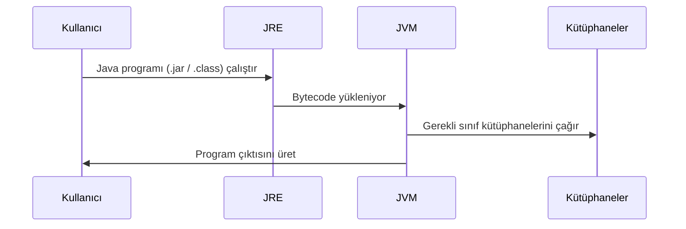
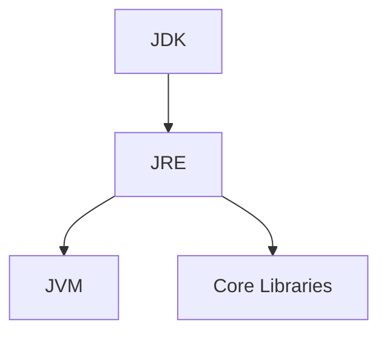

#Yazılım #ProgramlamaDilleri #Java 


![[JRE1.png]]


Java ekosistemi, üç ana bileşen etrafında şekillenmektedir: Java Development Kit (JDK), Java Runtime Environment (JRE) ve Java Virtual Machine (JVM). Bu üçlü, Java’nın platform bağımsızlığını ve “Write Once, Run Anywhere” (Bir kez yaz, her yerde çalıştır) mottosunu mümkün kılar.  
Bu yapının ortasında JRE, Java uygulamalarının çalışma zamanındaki tüm gereksinimlerini karşılayan temel bileşendir.

Java Runtime Environment (JRE), Java programlarını çalıştırmak için gerekli yazılım altyapısıdır.

- İçerisinde JVM ve Java Class Libraries bulunur.
- Derleme (compilation) aracı içermez.
- Bu nedenle JRE, geliştirici için değil, son kullanıcı için tasarlanmış bir dağıtımdır.

 Formel ifade:
> JRE = JVM + Core Libraries + Supporting Files


**JRE Mimarisi**
JRE’nin bileşenlerini üç temel grupta incelemek mümkündür:

1. JVM
2. Java Class Libraries
3. Destekleyici Dosyalar



Açıklama:

1. Kullanıcı bir Java programını çalıştırır.
2. JRE devreye girer ve JVM’i başlatır.
3. JVM, bytecode’u yükler ve yorumlamaya/derlemeye başlar.
4. İhtiyaç duyulan fonksiyonlar JRE kütüphanelerinden sağlanır.
5. Çalışma sonucunda kullanıcıya çıktı verilir.


**JDK - JRE - JVM İlişkisi**



|Katman|İçerik|Kullanım Alanı|
|---|---|---|
|**JVM**|Bytecode çalıştırıcı|Her Java uygulaması|
|**JRE**|JVM + Class Libraries|Program çalıştırma|
|**JDK**|JRE + Derleyiciler (javac, javadoc, jar)|Program geliştirme|

Kısaca:
- **JVM** → Çalıştırıcı motor.
- **JRE** → Çalışma ortamı.
- **JDK** → Geliştirme + Çalışma ortamı.

**Örnek Senaryo**

- **Kod**
```java
public class HelloJRE {
    public static void main(String[] args) {
        System.out.println("Merhaba JRE!");
    }
}

```
- **Derleme (JDK)**
```bash
javac HelloJRE.java

```
- **Çalıştırma (JRE)**
```bash
java HelloJRE

```
- **Çıktı**
```nginx
Merhaba JRE!
```
Buradan şu sonuç çıkar:
- Derleme için JDK gerekir.
- Çalıştırma için yalnızca JRE yeterlidir.


> [!info] Runtime Environment
> Programların işletim sistemi üzerinde değil, özel bir sanallaştırılmış ortamda çalışmasını sağlayan kavramdır. JRE bunun tipik bir örneğidir.


> [!danger] Taşınabilirlik
> JRE, platforma özel hazırlanır (Windowa/Linux/Mac), ancak Java programları bytecode sayesinde değişmeden çalıştırılabilir. Java programları bir kez derlenir ve JRE’nin kurulu olduğu herhangi bir işletim sisteminde çalışabilir.


> [!info] İPUCU
> [[001 -History Of Java]]
> [[005 -JDK]]
> [[002 -JVM]]
> [[006 -Compiler]]
> [[004 -Byte Code]]
> [[007 -Interpreter]]

***

***Abdullah TANRIVERDİ***


