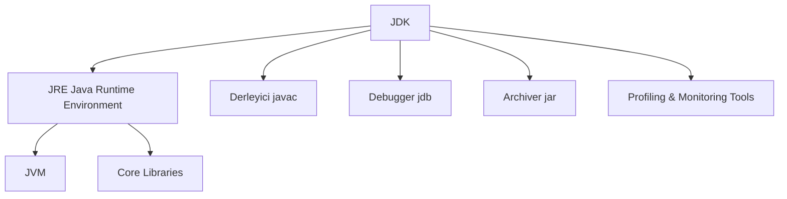
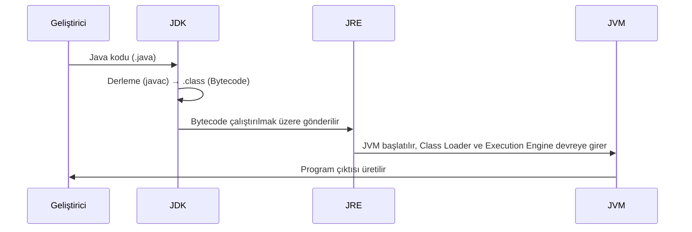

#Yazılım #ProgramlamaDilleri #Java 

![[JDK1.png]]

Java Development Kit (JDK), Java uygulamaları geliştirmek ve çalıştırmak için gerekli tüm araçları içeren tam geliştirme ortamıdır.

- JDK = JRE + Geliştirme Araçları (derleyici, debugger, paketleyici, profiling araçları).
- JDK olmadan Java kaynak kodu derlenemez.
- JDK, Java ekosistemindeki geliştirici odaklı platformdur.

![[JDK2.png]]

**JDK Yapısı**

- JVM - Bytecode'u çalıştıran motor
- Core Libraries - Temel sınıf kütüphanaleri
- Derleyici (javac) - `.java` dosyasını `.class` bytecode'a çevirir.
- Debugger (jdb) - JVM üzerinde çalışan uygulamalarda belirli analizler yapar.
- Archiver (jar) - Sınıfları ve kaynakları paketler.
- Profiling & Monitoring Tools - Analizler sağlar

**Açıklama:**

- **Derleme:** JDK gereklidir.
- **Çalıştırma:** JRE yeterlidir.
- **Runtime Yönetimi:** JVM tarafından sağlanır.

**JDK Araçları Ve İşlevleri**

|Araç|Kullanım|
|---|---|
|javac|Java derleyici|
|java|JVM başlatıcı|
|javadoc|Kod dokümantasyonu|
|jar|Paketleme|
|jdb|Debugging|
|jconsole|JVM izleme|
|jvisualvm|Profiling|
|jstat|JVM istatistikleri|
|jmap|Heap dump|
|javap|Bytecode çözümleme|

> [!NOTE] Bağımlılık
> OS bağımlılığı, her işletim sistemi için ayrı JDK

<iframe width="640" height="360" src="https://www.youtube.com/embed/KctLuhwFEQ8" frameborder="0" allow="accelerometer; autoplay; clipboard-write; encrypted-media; gyroscope; picture-in-picture" allowfullscreen></iframe>

> [!info] İPUCU
> [[001 -History Of Java]]
> [[004 -JRE]]
> [[006 -Compiler]]
> [[002 -JVM]]

***

***Abdullah TANRIVERDİ***

